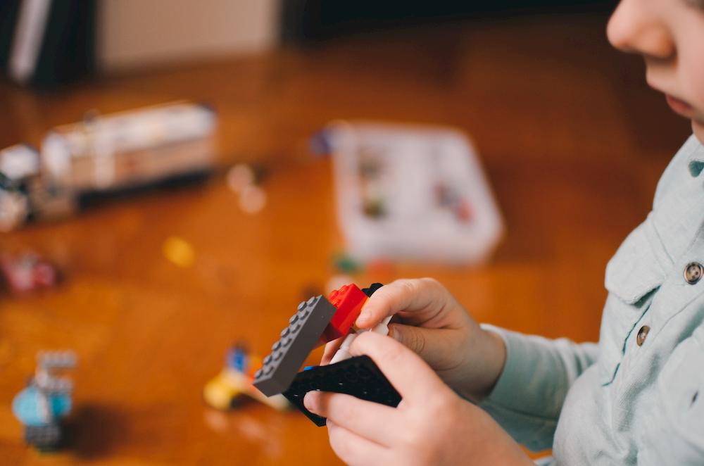

Learning to code something new can be a painful process. We inevitably get stuck or frustrated as we stumble through new concepts and ideas.

I've learned some hard concepts as a programmer. I've started from scratch in a new language as well as struggled through difficult concepts in an area I'm already comfortable in.

Working through those challenges has taught me that there's a process to learning to program in a different language or ecosystem. There's a pattern that emerges.

It's a little like the [five stages of grief](https://psychcentral.com/lib/the-5-stages-of-loss-and-grief/); some people are in different spots or skip steps, but everyone struggles through roughly the same process.

## 1. Exposure to a New Topic

When you're first introduced to a completely new concept, it can be overwhelming.

Handlebars templating stopped me dead in my tracks when I was in a code bootcamp.

My brain hurt. It was difficult to comprehend this concept, and my body was physically telling me to give up. I found it hard to read about, and I didn't want to listen in class or do the examples. When it came time to do the homework, I had to force myself to sit down and do it.

Eventually though, I got the hang of handlebars.

It took me a long time to realize and find comfort in the fact that this feeling of despair when facing a new, challenging task is temporary. It goes away with time and patience.

When you find yourself faced with an overwhelming task or topic, think of yourself like a sculptor. A sculptor can't produce a large piece in an afternoon with a sledgehammer; she has to chisel away slowly to transform the unforgiving rock into art. Hard topics are boulders we try to sculpt into artful understanding slowly over time.

You need rest, patience, and persistence to learn what at first feels insurmountable.

## 2. Developing a High-level Understanding

Many tutorials and guides zero in on the syntax and finite steps required to accomplish something. This is great if you're a veteran and well-versed in the subject matter.

So as a guitarist I might watch a 10 minute video and walk away with,

> _"Ah, so one major pentatonic scale cannot be applied universally to a chord progression. To sound good I have  to match the scale to the specific chord being played._

> _I can accomplish that by using CAGED patterns to match  up with the chords in a progression."_

And I get it, but I've played guitar for about 20 years. If you're not a guitarist or not familiar with basic music theory, that tip is gibberish to you.

Looking back at the handlebars example, I had to come to grips with a lot of foreign concepts.

I had to understand browsers, http, servers, databases, and client-side vs server-side rendering. I also had to learn what node and npm are, what package managers are, and how to work with modules in node.

I had to understand all of these things to understand the problem that handlebars was created to solve. Once I understood those things, it was easier to focus on handlebars itself, as opposed to the ecosystem it lives in.

If you find yourself completely lost on a concept, ask yourself:

_"Do I not understand this because it is complex, or do I not understand this because I don't understand the things that surround it?"_

There are many times I've run up against this:

* PassportJS - I didn't know how auth worked, how sessions worked, or how/what OAuth was, so passport was wizardry.
* Docker - I didn't know what a virtual machine was or why it was useful, therefore didn't understand containers.
* AWS - I didn't understand what "cloud architecture" was, so I didn't understand what it meant to deploy code in the cloud.

Seeking out high-level explanations for those topics and understanding them first was key to allowing me to learn how to use those tools.

## 3. Learning the Workflow

With a new coding skill usually comes a new workflow.

You're going to have to spend time figuring out how to edit and run your code, how to use other people's code, and what tooling fits your use case.

This is often a **boring**, ***miserable*** task.

To give an example, I've recently been learning Python. I immediately had questions:

1. Which version should I install, 2 or 3?
1. Can I edit and run Python with VSCode?
1. What the heck is a REPL?
1. How do I manage dependencies? Why do they install globally instead of locally by default?
1. What are virtual environments?
1. What is a Jupyter Notebook?
1. How do I run a Jupyter notebook file? _...Oh, hmmm. It comes with Anaconda_
1. What is anaconda?
1. Ananconda COMES with a Python installation!? 😫

Then I had to go back to step 2 and work through most of the same questions with conda 🤦‍

A lot tutorial makers and authors skip these crucial tidbits. Whether this is because they don't think their audience needs to be told the basics, or because they want to skip to the 🔥 **hot tips** 🔥, I couldn't say.

What I *can* say is that if you don't need the handholding, it's easy to skim further or skip that part of a tutorial. If you *do* need that extra instruction and it isn't there, you're now lost.

Personally, I really appreciate whenever someone takes the time to build the audience up to a topic and provides some clear, concise steps to follow to get up and running. It's a huge time-saver and let's me get right into the part I enjoy, which is coding.

So do your research and try to stay motivated while you're working though this part. It's easy to say, _"Ugh, forget it, I'll figure out npm another day"_, and then give up on learning Node.

However, once you get past this boring part of the process, you can start to learn the fun parts. 🦄

**NOTE:** If you're looking for a blog post topic, this is a great start. I **guarantee** that the workflow knowledge you take for granted is crucial to a novice's continued learning out there. You probably know more than you think you do, so share it.

## 4. Defining a Small, Attainable Goal

Once you've got a good workflow and can actually execute the code you're writing, it's time to figure out something to build.

This seems obvious, but it's actually a crucial step.

You need to scope yourself to something achieveable, but also useful and fun to build. Something that will challenge you, but not so much that you give up.

If you're learning web development, you don't want to start out trying to build a facebook clone. You're going to be sent down so many rabbit holes (servers, databases, react, etc) you'll never get anything accomplished.

As a beginner, you probably want to stick to HTML and just build a basic site. If you have a little knowledge, maybe use HTML and CSS to make a site with a nice layout and design. If that's too easy, maybe add in some interactivity with JavaScript.

Again, this seems simple, but can be devilishly challenging if you're entering a new area or subject. How do you know what's too complex? What's actually useful to learn?

You have to spend some time figuring out what your actual goals are for learning this new skill, then work backwards. What would you like to be able to build? What will you need to learn to build it? How can you practice those things?

As a guitarist, I started taking lessons as a young adult after about ten years of study. At that point I knew about scales, chords, how to play a song, etc. I knew all the basics.

I sat down across from my new teacher one night and he asked me, _"What would you like to learn?"_

I had no idea. He didn't either. How could he teach me?

Avoiding the creation of clearly-defined goals often leads to a lot of wasted time.

## 5. Putting in the Work

Coding is hard. Building useful things out of code is harder. Even veteran programmers struggle:

>20+ yrs dev exp, 8 books w/ 100k+ copies sold, 300k+ hours watched of my videos, 4k+ taught in person...

>And you know what? I still struggle to get my code to work and it's still a tedious slog. And my code still confuses me the next day.

>You're not alone in these struggles. - [Kyle Simpson](https://twitter.com/getify/status/972495616600293381)

Building that first project is going to be tough. You're going to hit some snags, discover you need to dive into some new topics, and probably end up on stack overflow more than once.

But you're going to learn a lot of things if you get it done.

The important thing here is to realize that you need to keep at it, and that if you planned correctly in the previous step, there's an end in sight.

Just remember that finishing that first project and realizing you've built something with an entirely new skill, language, or framework is...

✨🎵🕊**G L O R I O U S**🕊🎵✨

## 6. Maintaining Momentum

Once you have that first win, it's time to get another under your belt.

😮 *So soon?*, you say.

**Yes.** 😐

Go back to the previous two steps and start figuring out what you can build next that will get you further toward your goal. (You _do_ have a goal, right?)

Figure out how you can expand what you've learned and take those new skills into the next project. Build something bigger or completely different that's going to teach you a little bit more about how to reach that end goal.

Then build it. Build more things. **Keep learning.**

We signed up for this life when we decided to become developers. It's the bargain we made for a great job with widely-applicable skills. We accepted that we would be constantly learning and growing, that we would continue to hone our skills in an ever-changing industry.

The good news is that this process becomes easier. You begin to expect it.

_"Gosh, this is hard. This hurts my brain"_

Becomes: _"Ah, yes. This will take some time to learn."_

_"Ugh, where do I start?"_

Becomes: _"Hmm, better figure out a workflow."_

And so on.

I've been through these steps myself many times as a developer. You'll get faster if you keep going.