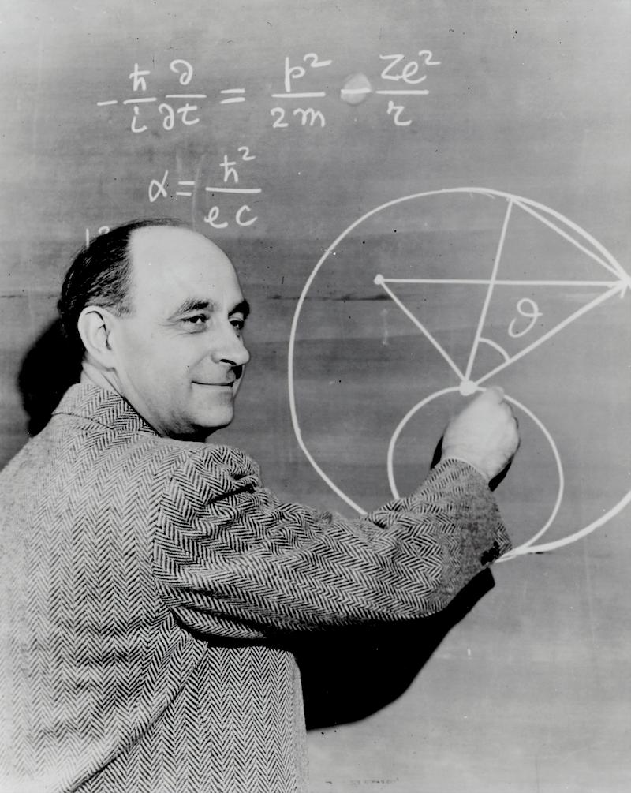
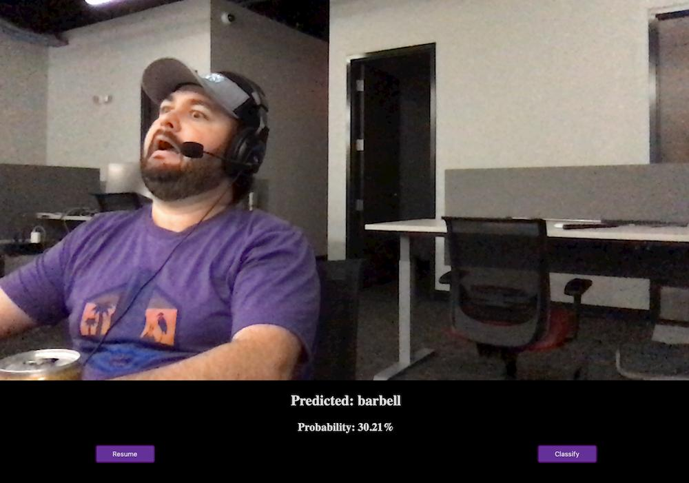

Machine Learning and Artificial Intelligence have been huge buzzwords in the Tech industry for [quite some time](https://towardsdatascience.com/google-trends-on-data-science-160146fea72a). Hearing them might make you picture self-driving cars or chat bots in your head and leave you wondering what kind of programming goes into those projects. AI in particular has been the stuff of science fiction for so long that it's hard not to be curious about it now that we're seeing real life projects surface in the news.

But what do those terms really mean? A cursory search of any of them will undoubtedly leave you separating science from marketing before you get to any valuable information. I've spent the past few months learning and researching Machine Learning and the Data Science field, so I know how difficult it can be to drill through the buzz and hype. This article is about that experience and how far I was able to get as a humble JavaScript developer.

Before we get started though, I want to kick things off with my favorite quote about Machine Learning and AI:

> Difference between machine learning and AI:
>
> If it is written in Python, it's probably machine learning
>
> If it is written in PowerPoint, it's probably AI

--[Matt Velloso on Twitter](https://twitter.com/matvelloso/status/1065778379612282885)

## I thought Machine Learning was only for geniuses (and I'm no genius)

I first started working with Machine Learning (ML) early on in my developer career when working with a team that was doing text-recognition work. My job was to create a front-end application that let users send documents to the backend for parsing.

Python is the main squeeze when it comes to ML/AI work for a lot of reasons, so I thought I wouldn't get much exposure to any ML work as a front-end JavaScript developer. However, I ended up tangling with ML quite a bit. Text Recognition models are pretty picky about input, so I ended up using JavaScript implementations of Python libraries to pre-process documents in the browser to match backend processes. I found out that ML libraries also had JS implementations. Not only could you use trained models to predict data in the browser, but you could create and train models there as well.

While it was awesome to see that JavaScript can really do all the things, Machine Learning is a specialized field that has massive foundations in calculus and statistics. So while I felt competent in my JavaScript abilities, I am definitely incompetent when it comes to higher level math I haven't touched since college. Because of the heavy maths involved in ML, I figured the whole field was beyond me as a humble front-end developer. When I moved off of that project at work, I deemed ML beyond me and forgot about it for a while.

## You don't need to be a Mathematician to try your hand at Machine Learning



_(Pictured: What I thought all Data Scientists looked like before this journey.)_

While I wrote off ML, I still wanted to learn Python. I also run a [meetup](https://www.meetup.com/orlando-juniors/), so I decided to get some workshops together to teach the community (and myself) Python. I reached out to the [local Python User Group](https://www.meetup.com/OrlandoPython), and the organizer Michael DuPont and I got together and planned out a series of talks and workshops. Michael would teach, and I would book the venues.

The workshops were awesome, and we were also able to [record them for YouTube](https://www.youtube.com/playlist?list=PL5XS6NAljuIyolJIaZjwoMHmBW2oHsr-G). That experience taught me a lot about Python and its ecosystem, but also some interesting lessons about Machine Learning.

At the [end of the intro talk](https://youtu.be/pTtT8qHj_nc?t=3832), Michael introduced [TPOT](https://epistasislab.github.io/tpot/), an automated ML tool, and used it to train a model to predict housing prices in Boston. This was fascinating to me because what TPOT does is take data and figure out how to make a model and train it on its own. It essentially cut out all the math and statistics for you. This planted the seed in my head that maybe, just maybe, being a developer is enough to get your feet wet with ML.

## Using JavaScript for Machine Learning

I also run a [podcast](https://techjr.dev), and through that I ended up meeting [Gant Laborde](https://twitter.com/GantLaborde), a JavaScript developer with a passion for data science. We interviewed Gant about [Machine Learning in JavaScript](https://techjr.dev/episodes/2019/machine-learning-with-java-script-gant-laborde-teaches-us-tensorflow-js), and really dug into how to get started with ML.

Gant also revealed that he was working on a [JavaScript Machine Learning course](https://academy.infinite.red/p/beginning-machine-learning-with-tensorflow-js). This piqued my interest because almost all ML tutorials focus exclusively on Python. After we were finished recording, I offered myself up as a guinea pig for Gant's course, and he graciously sent my co-host and I copies of the course to try out ourselves.

Shortly after, Gant released a [free intro to Machine Learning course](https://academy.infinite.red/p/ai-demystified-free-5-day-mini-course). Naturally I signed up for that too.

The main course is meant to take 3 weeks, and the intro course is meant to be a 5-day course. It took me about 3 months to work through both courses. My completion time ballooned past the projected 4 weeks for both courses because of my busy schedule, but also because I truly wanted to grasp the material and give myself every chance to learn everything that Gant had poured into the course.

So I took my time ⏳, drank many cups of coffee ☕, and wrote a **lot** of code 👨‍💻.

Let's talk about what I've learned 🧙‍♂️.

## Machine Learning is really about prediction 🔮

The general intro course was a fantastic intro to Machine learning. It taught me that ML is really about boiling a data set down to numbers, analyzing a huge group of those numbers, and then being able to predict outcomes when given data it hasn't seen before. It also taught me about the types of Machine Learning and their applications in real life.

The Machine Learning and Data Science that we deal with are more about **Artificial Narrow Intelligence (ANI)** than **Artificial General Intelligence (AGN)**. AGN is the stuff of science fiction: robots that can function like humans and make decisions for themselves, SkyNet, etc. ANI is about focusing on a specific problem or question. Some examples of ANI include figuring out if a picture is of a cat or a dog, predicting sales numbers based on historical data, or detecting when a person's eyes are open from a video feed.

But how does an algorithm learn to answer those questions?

In the example of the Boston Housing data, the data set has a bunch of features like location, crime rate, proximity to schools, etc. that the computer analyzes alongside the price of the home. An ML algorithm will read thousands of those data points to be able to approximate a home price based on those features.

Think about a line from your middle school math classes. There's a formula that will tell you what x and y coordinates will fall on that line with 100% accuracy. Let's say our line has a formula of `y = x`. Using that formula, we could very easily figure out if a set of coordinates are on that line, right? If you have points `(0, 0)`, `(1, 1)` and `(2, 2)`, you know that as long as they're equal, they live on the line.

But how would Machine Learning approach this problem? Imagine you didn't have a formula that could tell you with 100% accuracy whether a point was on the line or not. How could ML help?

To solve this with ML, you would feed your model thousands of coordinates that are labeled as on or off the specified line. After doing a lot of math and burning a lot of processing time, you'd have a model that could tell you with a certain confidence (a percentage) how likely any given point is to exist on that line.

[This joke tweet](https://twitter.com/jebbery/status/995491957559439360) is a great summary of ML:

> Machine Learning Job Interview:

> Me: I'm an expert in machine learning

> Interviewer: What's 9 + 10?

> Me: It's 3.

> Interviewer: Not even close. It's 19.

> Me: It's 16.

> Interviewer: Wrong. Its still 19

> Me: It's 18.

> Interviewer: No, it's 19.

> Me: It's 19.

> Interviewer: You're hired.

## What kind of coding is involved in Machine Learning?

Thankfully, the inner-workings (calculus and linear algebra 💀) of training a model are abstracted away from us by ML frameworks like TensorFlow. So we don't have to construct the actual algorithms used to process data and train models.

However, there's still a level of math that you have to grapple with when dabbling in Machine Learning. You need to first be able to process data to pass into ML algorithms and models. You also need to have some knowledge of ML framework settings and configuration.

### Preparing Data

Most of the work done by data scientists is involved in **preparing the data**. When we interviewed [Data Scientist Amelia Bennett on our podcast](https://techjr.dev/episodes/2019/what-is-data-science-with-amelia-bennett), she described herself as a high-paid data janitor, and described data science itself as a "21st century dirty job".

If you've ever wondered how a computer can learn to parse images, sounds, and language, the answer is math. Anything that can be described mathematically can be translated to numbers and fed into ML models. The job of the data scientist is to not only select the data, but convert it. In computer vision for example, this means converting images to arrays of pixels (RGB and location) that the algorithm can use for training. Natural language processing involves describing soundwaves using math--taking frequency and pitch numbers over time to identify spoken words.

Fortunately, there are tools to help you convert non-number data to numbers out there. Tensorflow has a lot of utilities dedicated to helping you process images for instance. Still, you need to be able to use those tools and know which ones to reach for.

### Training Configuration


Machine Learning frameworks abstract away most of the math, but you're still stuck needing to know how different algorithms affect training. So you won't be solving any problems on paper, but you're still going to be reading about mathematical concepts with scary names like `softmax`, `sigmoid`, and `ReLu`.

There's also something to be said about the _amount_ of terms like those activation function names I mentioned above. When using tensorflow specifically, you might feel like you've got more knobs to twist and turn than you really know what to do with. **The TensorFlow API is massive**, and it's hard to imagine someone mastering all of it.

**Note:** You may remember that there are autoML frameworks like TPOT that I mentioned above. These don't require a ton of configuration, but also give you less control over the outputted result. While these tools are useful, you'll likely find yourself using something TensorFlow or something similar the further you get into ML.

### Guess Work

I personally found the amount of configuration at my fingertips to be completely overwhelming. I am the type of person that loves to know exactly what I'm doing and why. However this left me at odds with a data scientist's typical workflow.

**Machine Learning requires a lot of experimentation**. I used to think that data scientists trained models in one go, but in reality they may train models over and over again before getting desirable results. When training models, there's many various settings to tweak, and selecting the right ones is more of a matter of trial and error than anything else. I had to let go of my need to understand and comprehend everything before I could embrace the experimentation required to solve ML problems.

To put it another way, data scientists are a bit like fictional mad scientists haphazardly mixing chemicals in a lab--except data scientists are mixing mathematical functions together instead of fluid-filled beakers of various colors.

## Examples of Machine Learning with JavaScript

There's really two main types of projects when you're working with Machine Learning: **using a pre-trained model**, or **building and training your own model**. For the latter, JavaScript is a less than optimal solution, but when it comes to using pre-trained models, JavaScript is a fantastic tool. You can quickly make some impressive ML projects by utilizing browser APIs and web technology.

**Note:** These demos were all made from concepts and lessons learned from [Gant Laborde's AI course](https://academy.infinite.red/p/beginning-machine-learning-with-tensorflow-js).

<!-- <script async src="https://static.codepen.io/assets/embed/ei.js"></script>
```js js-live no-code no-edit scripts=codepen!https://static.codepen.io/assets/embed/ei.js
``` -->

### Pre-trained Model Examples

#### Image API + MobileNet Example

In this demo, I pulled images from the [lorem picsum API](https://picsum.photos) and used Reach to hook them up to [MobileNet](https://github.com/tensorflow/tfjs-models/tree/master/mobilenet), which is a pre-trained model that can classify images.

<p class="codepen" data-height="607" data-theme-id="default" data-default-tab="result" data-user="mynar7" data-slug-hash="ZEzNYEo" data-preview="true" style="height: 607px; box-sizing: border-box; display: flex; align-items: center; justify-content: center; border: 2px solid; margin: 1em 0; padding: 1em;" data-pen-title="React + MobileNet ML Images app!">
  <span>See the Pen <a href="https://codepen.io/mynar7/pen/ZEzNYEo">
  React + MobileNet ML Images app!</a> by Lee (<a href="https://codepen.io/mynar7">@mynar7</a>)
  on <a href="https://codepen.io">CodePen</a>.</span>
</p>

#### Webcam + MobileNet Example



I was also able to [hook MobileNet up to the webcam browser API](https://codepen.io/mynar7/full/MWYgQaM) so that you can point your phone/camera at an object and classify it.

### Browser-based Model Training Examples

#### Solving FizzBuzz with TensorFlow

This example feeds a model thousands of numbers (100 through 3100) that have been solved using a simple [fizzbuzz](https://www.tomdalling.com/blog/software-design/fizzbuzz-in-too-much-detail/) algorithm. Then it tries to guess whether numbers 1-100 should be fizz, buzz, or fizzbuzz.

<p class="codepen" data-height="365" data-theme-id="default" data-default-tab="result" data-user="mynar7" data-slug-hash="qBEGYoJ" data-preview="true" style="height: 365px; box-sizing: border-box; display: flex; align-items: center; justify-content: center; border: 2px solid; margin: 1em 0; padding: 1em;" data-pen-title="FizzBuzz Solved with TensorFlow">
  <span>See the Pen <a href="https://codepen.io/mynar7/pen/qBEGYoJ">
  FizzBuzz Solved with TensorFlow</a> by Lee (<a href="https://codepen.io/mynar7">@mynar7</a>)
  on <a href="https://codepen.io">CodePen</a>.</span>
</p>

#### Cat/Dog image recognition with TensorFlow


## Other Types of Machine Learning

I've only experimented with **supervised** learning so far. The examples we've talked about have all involved **supervised** learning, meaning we are telling the algorithm what to look for and giving it examples with features to learn from. Supervised learning is fairly simple to wrap your head around, but there's more methods and applications of ML out there.

Two examples of different ML methods are **unsupervised** and **reinforcement** learning. In **unsupervised** learning, you give the algorithm a data set that's unlabeled and let it discover and classify things on its own. With **reinforcement** learning, where the algorithm learns how to accomplish tasks through good or bad outcomes. [Think of a computer learning to beat a mario level](https://youtu.be/qv6UVOQ0F44) as an example.