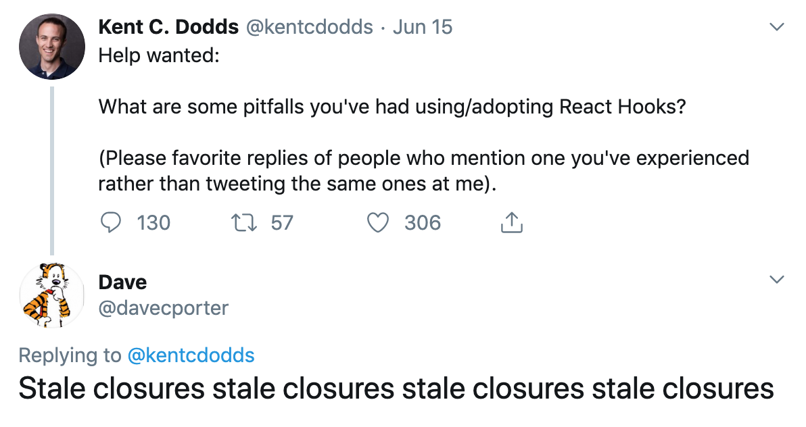

If the React docs leave you in the dust, or Dan Abramov's [blog](https://overreacted.io/a-complete-guide-to-useeffect/) makes you feel like you're reading a scroll handed down from Mt Olympus written in ancient Greek, you're not alone.

Sometimes the pantheon of React Gods have a hard time translating their wisdom into language the rest of us can understand. It usually goes like this: You hit a snag with React, google your issue, and read a blog or Stack Overflow post with some advice that makes you feel more lost than when you started.

I've certainly fallen victim to this many, many times. Particularly with `useEffect`. Before we dive into this particular hook, let me say that I love writing React with hooks and wouldn't want to go back to classes. That said, `useEffect` is a big pain point.

## What is an "effect" anyway?

To really wrap your head around `useEffect`, let's back up a little bit and talk about programming and JavaScript.

The effects that `useEffect` is named for are what we affectionately refer to as "side effects".

So what is a side effect? It's a bit of code that reaches out and ...does something else. It's an abstract concept, so let's talk in examples.

Here's a function with NO side effects:

```js
function add(a, b) {
    return a + b
}
```

The function `add` does nothing except take an input and return an output. It doesn't reach outside itself to mess with anything else!

Let's introduce a side effect.

```js js-live autorun linkId=ex1 no-edit
const resultDiv = document.getElementById('add-example')
function add(a, b) {
    const result = a + b
    resultDiv.textContent = `The Result is ${result}`
    return a + b
}
add(3, 4)
```

```html html-live linkId=ex1 no-edit
<div id="add-example"></div>
```

Now our function reaches outside of itself to update the DOM (short for [Document Object Model](https://www.youtube.com/watch?v=H63dVFDuJDM)) and show the result. This additional behavior is a side effect.

## Side Effects in React

So what about React? It's a library that pretty much only updates the DOM. A view library, if you will. So what would you call a side effect in React?

Anything outside of updating the page. If you're not using React to update state or render HTML, that's a side effect. It's any non-React thing.

This means anytime you call an API, use `setInterval`/`setTimeout`, add a keyboard listener, or really anytime you mess with the `window` object you're introducing side effects.

Hooks are amazing and let you write really readable, reusable code... except when you're dealing with side effects. And that's unfortunate, because when you think about it, most of the fun, interesting stuff we do as web developers revolves around side effects.

Let's take a step back from hooks for a minute and look at how we would handle side effects in class-based components.

### Class-based Components and Side Effects

In class-based components, we would use lifecycle methods to perform side effects. For example, on `componentDidMount` we would call APIs to get data for render.

_"Why not call the API in the constructor function?"_, you might ask. Well, because React says stuff we use for render goes in "state" and we can't mess with state until our component is loaded onto the page. If we try to update state before the component is loaded, we get errors.

Here's a typical class-based component hitting the [PokeAPI](https://pokeapi.co/):

```jsx react-live no-edit
class Pokemon extends React.Component {
    constructor() {
        super()
        this.state = null
    }
    componentDidMount() {
        fetch('https://pokeapi.co/api/v2/pokemon/gengar/')
        .then(res => res.json())
        .then(res => {
            this.setState(res)
        })
    }
    render() {
        const pokemon = this.state
        const style = {textTransform: 'capitalize'}
        return (
            <div>
            { pokemon
                ? <>
                    
                    <p style={style}>Name: {pokemon.name}</p>
                    <p style={style}>
                        Type: {pokemon.types.map(x => x.type.name).join(', ')}
                    </p>
                </>
                : 'Loading...'
            }
            </div>
        )
    }
}
```

This works well, except when it doesn't. What happens when we want to hit the API again to grab a different pokemon? What if this component is attached to a certain route in our app and the route changes, but the component doesn't unmount/remount. What if the user goes to a different page and the component unmounts before the API call finishes?

The answer is to add more lifecycle methods like `componentDidUpdate` and `componentWillUnmount` to perform more API calls and prevent weird unmounting errors. So we add those lifecycle methods in to handle all our edge cases. And by the time we're done, we realize most of our component consists of lifecycle code.

## Then Came React Hooks

The React team realized that the class API is a little unwieldy and hard to reason about. People were making [lifecycle flowcharts](https://levelup.gitconnected.com/componentdidmakesense-react-lifecycle-explanation-393dcb19e459) trying to understand the inner workings of React ...it was a mess.

So at ReactConf in October of 2018, after Sophie Alpert outlined just how bad classes are to use, Dan Ambramov got on stage and introduced hooks (You can watch the video [here](https://youtu.be/dpw9EHDh2bM?t=643)).

Hooks introduced statefulness in functional components, as well as a new way to handle side effects. Hooks made React code more reusable with less code--a huge win!

Except for one small quirk. Each render, the whole component/function is re-run.

Let's look at an example of a hooks-based component:

```jsx react-live no-edit
function RerenderExample() {
    const [bool, setBool] = React.useState(false)
    const randomNum = Math.random()
    return (
        <div>
            <p>This number will be different each time you click the button:</p>
            <p>{randomNum}</p>
            <button onClick={() => setBool(!bool)}>Trigger a render</button>
        </div>
    )
}
```
We're not even using `bool` in our rendered JSX, yet the whole function runs everytime the state changes. **Every render, everything inside the component re-runs: function definitions, variable creation/assignment, etc.**

If you're thinking _"what if I have to do something computationally expensive inside a component? This can't be performant..."_, that's an astute observation. An expensive operation in a functional component _wouldn't_ be performant. In fact `useCallback` and `useMemo` exist as escape hatches for this very problem. Kent C Dodds has a challenging read on those [here](https://kentcdodds.com/blog/usememo-and-usecallback), but to summarize, according to Kent you shouldn't worry about the re-renders until you see performance impacts.

(**Note**: If you're unfamiliar with hooks, bookmark that article and come back to it when you're ready. Don't worry about memoization until you have to.)

Hooks like `useState` employ some magic under-the-hood to avoid the re-render problem. That's great, and it seems simple enough using `useState`, but what about when you need to do things outside of setting state?

Enter `useEffect`. Gone are those pesky lifecycle methods, hooray! However this hook comes with its own weirdness. First let's check out the syntax:

```jsx
//accepts two arguments: a function, and dependency array
useEffect(() => {
    // do stuff
    return () => {} //function to undo our stuff from above when component unmounts
}, []) //dependency array of things to watch for changes on
```

So you pass `useEffect` a callback function to run that contains your side effects, and then an array of things to watch. If the watched things change, `useEffect` will re-run our callback function. If you need to clean up your side effect on unmount, return a function that contains that code.

Let's look at our pokemon example with hooks and `useEffect`:

```jsx react-live no-edit
function Pokemon() {
    const [pokemon, setPokemon] = React.useState(null)
    React.useEffect(() => {
        fetch('https://pokeapi.co/api/v2/pokemon/gengar/')
        .then(res => res.json())
        .then(res => {
            setPokemon(res)
        })
    }, []) // empty array means nothing to watch, so run once and no more
    const style = {textTransform: 'capitalize'}
    return (
        <div>
        { pokemon
            ? <>
                
                <p style={style}>Name: {pokemon.name}</p>
                <p style={style}>
                    Type: {pokemon.types.map(x => x.type.name).join(', ')}
                </p>
            </>
            : 'Loading...'
        }
        </div>
    )
}
```

If you're staring at that empty dependency array, you've noticed the first `useEffect` quirk. By passing an empty array, we're saying "only ever do this once". The React pantheon tells us that on rare occasions that's ok, but most of the time you want something in there. The reason is that usually you want to synchronize with _something_ in your code, not just perform the effect once. For example, what if our pokemon component depended on a route parameter or props, anything that said, "go get a new pokemon" without mounting/unmounting?

Let's say our component depended on a prop `pokemonToGet` that was an argument telling it which pokemon to get from the API. Let's also add a tiny form for testing purposes:
```jsx react-live use-render no-edit
function Pokemon({pokemonToGet}) {
    const [pokemon, setPokemon] = React.useState(null)
    React.useEffect(() => {
        fetch(`https://pokeapi.co/api/v2/pokemon/${pokemonToGet}/`)
        .then(res => res.json())
        .then(res => {
            setPokemon(res)
        })
    }, [pokemonToGet]) // get a new pokemon with the pokemonToGet prop changes
    const style = {textTransform: 'capitalize'}
    return (
        <div>
        { pokemon
            ? <>
                
                <p style={style}>Name: {pokemon.name}</p>
                <p style={style}>
                    Type: {pokemon.types.map(x => x.type.name).join(', ')}
                </p>
            </>
            : 'Loading...'
        }
        </div>
    )
}
function PokemonForm() {
    const [inputValue, setInputValue] = React.useState("rowlet")
    const [pokemonToGet, setPokemonToGet] = React.useState("gengar")
    function getPokemon() {
        setPokemonToGet(inputValue.trim().toLowerCase())
        setInputValue("")
    }
    return (
        <div>
            <input onChange={(e) => setInputValue(e.target.value)}
                value={inputValue} type="text"/>
            <button onClick={getPokemon}>
                Get Pokemon
            </button>
            <Pokemon pokemonToGet={pokemonToGet} />
        </div>
    )
}
render(<PokemonForm />)
```

Great, now our component fetches a new pokemon based on our prop changes. With classes we would've had to play with `componentDidUpdate` and such to achieve a similar effect.

Ryan Florence has a great [tweet](https://twitter.com/ryanflorence/status/1125041041063665666?lang=en) to summarize `useEffect`'s usage:

>The question is not "when does this effect run" the question is "with which state does this effect synchronize with"

> useEffect(fn) // all state

> useEffect(fn, []) // no state

> useEffect(fn, [these, states])

That "all state" case he mentions where you pass in nothing for dependencies is a weird one. I've personally never found a use for it. We know that the whole component runs with each render, so I'm wondering if there's some weird edge case that requires you to use `useEffect(fn)` without any dependency array. In any case, most of the time you're going to be working with this: `useEffect(fn, [these, states])`.

## UseEffect and Previous State: Where things fall apart

The mental model so far for `useEffect` seems straight-forward enough: synchronize it with certain state changes of your choosing. The problem is when you need to reference that state in an effect, not just know if it changed.

**You don't get access to current state inside of `useEffect`.**

We didn't see this in our API call example because we're simply overwriting the previous state.

Let's look at a simple example:

```jsx react-live
function Timer() {
    const [count, setCount] = React.useState(0)

    React.useEffect(() => {
        const intervalId = setInterval(() => {
            setCount(count + 1)
        }, 1000)
        return () => clearInterval(intervalId)
    }, [])

    return (
        <div>The count is: {count}</div>
    )
}
```

Seems like we did all the right things (even cleaning up our side effect on unmount) but our counter isn't incrementing. Is it a `this` issue? Do we not have access to the `window` object that `setInterval` belongs to?

No and no. If you added a `console.log` into that interval, you'd see it tick every second.

I'll prove it to you:

```jsx react-live
function Timer() {
    const [count, setCount] = React.useState(0)
    const [randomNum, setRandomNum] = React.useState(0)

    React.useEffect(() => {
        const intervalId = setInterval(() => {
            setCount(count + 1)
            setRandomNum(Math.random())
        }, 1000)
        return () => clearInterval(intervalId)
    }, [])

    return (
        <div>
            <p>The count is: {count}</p>
            <p>RandomNum is {randomNum}</p>
        </div>
    )
}
```
Notice we get a new random number every second. Our interval code is fine.

We're able to set new state, but are unable to access current state.

This is a "**stale closure**". I won't get into closures, but just know that because of the implementation of React/hooks, the count variable is always going to be 0 in our interval function. It's an old reference.

**Update 9/7/19**: It turns out, there's a solution for simple examples like above, as pointed out by John Tucker (thanks John!). Much like `setState` in class-based components, `useState` can also accept a callback function that receives the previous state as an argument. The [React Docs](https://reactjs.org/docs/hooks-reference.html#functional-updates) also make note of this.

Here's an example of the quick fix:

```jsx react-live
function Timer() {
    const [count, setCount] = React.useState(0)

    React.useEffect(() => {
        const intervalId = setInterval(() => {
            //let's pass a function instead
            //the argument is the current state
            setCount(count => count + 1)
        }, 1000)
        return () => clearInterval(intervalId)
    }, [])

    return (
        <div>The count is: {count}</div>
    )
}
```

This still doesn't solve all of our problems, though. If you need to access to the latest state inside `useEffect`, but _not_ update it, you would have to start wrapping your `useEffect` code in `setState` callbacks, and then returning the unchanged state at the end. This could quickly become an absolute mess, particularly if you're working with multiple state values.

Another possible solution could be to work only with `useReducer`, as that receives previous state, but filling your reducer with side effects also seems very messy, and I wouldn't suggest anyone stop using `useState` entirely.

In any case, I've fallen into the stale closure trap many, many times when writing hooks. I didn't even know it had a name until I read it in [this talk](https://docs.google.com/presentation/d/1PUvpXMBEDS45rd0wHu6tF3j_8wmGC6cOLtOw2hzU-mw/edit#slide=id.p) by Rich Harris, the man behind [Svelte](https://svelte.dev/).

Apparently, I'm not the only one tripping over them in hooks, either:



React even mentions it in their [docs](https://reactjs.org/docs/hooks-faq.html#why-am-i-seeing-stale-props-or-state-inside-my-function):

>"Any function inside a component, including event handlers and effects, “sees” the props and state from the render it was created in."

I read this prior and it made little sense to me before really digging into the issue. I imagine it could be a bit of a black eye for React, so perhaps they don't wish to call it out too loudly.

Dan Abramov, however, describes the problem better in his [blog](https://overreacted.io/a-complete-guide-to-useeffect/) and even provides a solution:

>"Effects always “see” props and state from the render they were defined in. That helps prevent bugs but in some cases can be annoying. For those cases, you can explicitly maintain some value in a mutable ref."

This was helpful, because it provided a solution in the form of `useRef` (Thanks Dan!), but it left me in the dark as to how it would help avoid the issue (mostly because I didn't understand `useRef`).

## What is a "ref", and how do you use one?

So traditionally, refs were meant to let you directly access an html element. For instance, let's say you needed to focus an input field. You have to bail out of React and use regular JavaScript to call `.focus()`. Hooks actually make this fairly simple:

```jsx react-live
function InputField() {
    const inputRef = React.useRef()
    return (
        <div>
            <input type="text" ref={inputRef} />
            <button onClick={() => inputRef.current.focus()}>
                Click to Focus the input
            </button>
        </div>
    )
}
```

Great! Refs are an easy escape hatch to access native DOM APIs when we need to.

...but how does that help us fix our stale closure counter example?

## Using Refs to avoid Stale Closures

The [React docs](https://reactjs.org/docs/hooks-faq.html#is-there-something-like-instance-variables) compare refs to "instance variables". I didn't know what that meant (thanks [Wikipedia](https://en.wikipedia.org/wiki/Instance_variable)), so I didn't find that helpful.

I managed to wrap my head around refs by thinking about them this way:

**Refs exist outside of the re-render cycle.**

Think of refs as a variable you're setting to the side. When your component re-runs it happily skips over that ref until you call it somewhere with `.current`.

Let's see the fix for our timer example:

```jsx react-live
function Timer() {
    const [count, setCount] = React.useState(0)
    const countRef = React.useRef(0)

    React.useEffect(() => {
        const intervalId = setInterval(() => {
            countRef.current = countRef.current + 1
            setCount(countRef.current)
        }, 1000)
        return () => clearInterval(intervalId)
    }, [])

    return (
        <div>The count is: {count}</div>
    )
}
```

If we wanted to stop the timer at say, 10, we could easily do so using the ref:

```jsx react-live
function Timer() {
    const [count, setCount] = React.useState(0)
    const countRef = React.useRef(0)

    React.useEffect(() => {
        const intervalId = setInterval(() => {
            if (countRef.current === 10)
                return clearInterval(intervalId)
            countRef.current = countRef.current + 1
            setCount(countRef.current)
        }, 1000)
        return () => clearInterval(intervalId)
    }, [])

    return (
        <div>The count is: {count}</div>
    )
}
```

Here's the alternative using the `setState` callback approach, for sake of comparison:

```jsx react-live
function Timer() {
    const [count, setCount] = React.useState(0)

    React.useEffect(() => {
        const intervalId = setInterval(() => {
            setCount(count => {
                if (count === 10) {
                    clearInterval(intervalId)
                    return count
                }
                else return count + 1
            })
        }, 1000)
        return () => clearInterval(intervalId)
    }, [])

    return (
        <div>The count is: {count}</div>
    )
}
```

I could see this quickly approaching callback hell, so I would caution against using the callback approach if you're doing something more complex.


## State Versus Refs

Is it possible to ditch state entirely and just use refs?

You might be inclined to think you could use refs instead of state for your component and just sidestep all this weird behavior.

You can't. **Refs aren't reactive.** When you change a ref, it doesn't cause a re-render. (Remember, they exist outside of the re-render cycle).

This won't work:


```jsx react-live
function Timer() {
    const count = React.useRef(0)

    React.useEffect(() => {
        const intervalId = setInterval(() => {
            count.current = count.current + 1
            //console.log('Ref example count: ' + count.current)
        }, 1000)
        return () => clearInterval(intervalId)
    }, [])

    return (
        <div>The count is: {count.current}</div>
    )
}
```

That component is actually counting upwards internally, but it's not causing the HTML to update. You need `useState` for that. (Go ahead and uncomment the `console.log` if you don't believe me)

Here's an example to demonstrate refs vs state:

```jsx react-live use-render
function Counter() {
  const [count, setCount] = React.useState(0)
  const countRef = React.useRef(0)

  return (
    <div>
      <p>State Count: {count}</p>
      <button onClick={() => setCount(count + 1)}>
        Increment State Count
      </button>
      <p>Ref Count: {countRef.current}</p>
      <button onClick={() => countRef.current = countRef.current + 1}>
        Increment Ref Count
      </button>
    </div>
  )
}

render(<Counter/>)
```

You won't see the ref count change until you trigger a re-render by setting state.

## Parting Thoughts

I love hooks and functional components in React, but the quirks I've outlined have given me pause. I don't like being required to know so much about the inner-workings of React to use it. I think it presents a roadblock for those learning React, and I hope in the future the React team comes up with some better ways to handle these quirks.