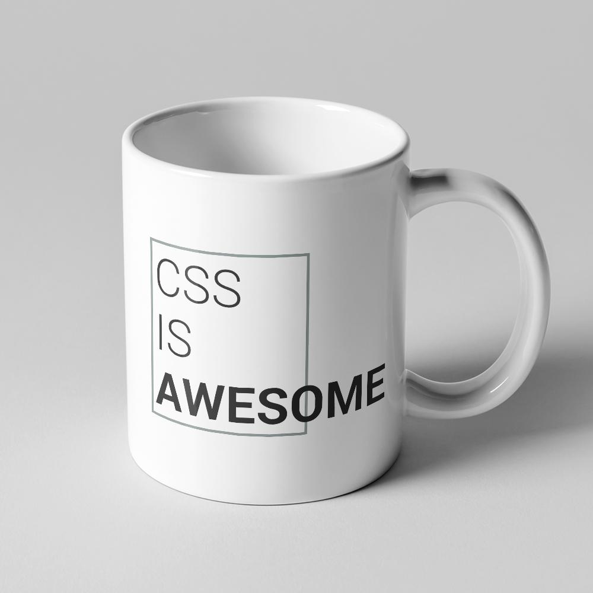

In my time as a front-end developer, I've seen and heard a lot of gripes about CSS.

I often see people reach for a CSS framework like Bootstrap, Materialize, Bulma, Tailwind, etc. to avoid writing CSS. While CSS frameworks can be great accelerators, they often require solid CSS skills to wield them effectively. That is to say, if you're not very good at CSS, you're probably not going to be that great using a CSS framework either.

Framework or not, when hitting a snag people tend to throw more and more lines of CSS at the problem until they get a working solution. In essence, they're following the "can't tie a knot? Tie a lot!" method of development.

Unfortunately a massive, improper knot is unreliable and weakens the rope.

So don't be the "see what sticks" developer. I'm going to show you how you can add a little organization to your stylesheets that will get you up and running quickly without pulling your hair out.

## Preparing for Success: Reset vs Normalize

HTML elements come with their own default styling. Unfortunately, much of it is flat-out ugly (Looking at you, form input elements).

To make things worse, browsers _still_ have not reached 100% parity on that default styling. This means certain elements appear differently on different browsers.

You may even end up overriding that default styling over and over again in your stylesheet to achieve the look or positioning you want. Don't fall into this trap. Address the default styles once.

That said, there are two powerful, pre-built solutions for taming default styles: Reset and Normalize.

**Note**: Don't forget to add these **before** all other styles--remember the cascade!

### CSS Reset

[CSS Reset](https://cssreset.com/scripts/eric-meyer-reset-css/) is essentially the nuclear option. It wipes out all the styles from all of the elements, more or less making them differ in name only. `<h1>`'s look like `<p>` tags, for example.

This is a valid solution if you need to start from scratch, but you typically don't need to obliterate the default styles completely. If you do, you're going to have to go back in and make that `<h1>` large and bold again with _more_ CSS.

### Normalize CSS

[Normalize CSS](https://necolas.github.io/normalize.css/) is the more elegant solution than a reset. Its goal is to even out the kinks between browsers and address the most common issues with default styles, while leaving the rest intact.

Most CSS frameworks have a normalize built into them already, so you won't need to add this in if you're using Bootstrap, Materialize, etc.

### The Quick and Easy Option

There's a third option here worth mentioning. If you're trying to get things done quickly and not using a framework, you can eliminate most of the funk with something like this:

```css
* {
    margin: 0;
    padding: 0;
    /* box-sizing: border-box */
    /* border: 1px solid black */
}
```

This ends up stripping out all the micro-adjustments you typically have to come in and do later if you roll with the default padding and margin on elements. (The `*` is a wildcard selector that selects all elements)

You can optionally toss in the `box-sizing` bit to make sure that your widths/heights are not additive. This means if you say an element is `500px`, it will be exactly that regardless of padding, margin, or border that you add in later. I don't typically find myself reaching for this, but it can help when you're doing pixel-perfect layouts.

**Note**: The last bit is a little 🔥 **hot tip** 🔥 for debugging CSS layouts. If you're wondering how big or what shape an element is, adding a border can quickly show you how something is being rendered. This adds a border to all elements, showing you how everything is laid out on the page.

## Writing Good Markup and 'Going with the Flow'

[CSS Zen Garden](http://www.csszengarden.com/) showed us the awesome power of CSS to style HTML regardless of how it is written.

_What's that quote about power and responsibility...?_ 🤔🕷

HTML has a certain [flow](https://developer.mozilla.org/en-US/docs/Learn/CSS/CSS_layout/Normal_Flow) to it. It's read and rendered top-to-bottom, certain elements are `block` or `inline`, etc. The greater your knowledge of this default behavior, the better you can use it to your advantage, and the less CSS you'll have to write to change it.

Yes, CSS can do amazing things to change the default behavior of markup. However, if you write your HTML with your end goal in mind, you'll end up weaponizing CSS less often to make your markup behave appropriately.


## Mastering Layouts with Flexbox and Utility Classes

Layouts and positioning of elements is probably the biggest source of strife when learning CSS. You want an element to be in a particular spot, so you write ten lines of CSS that _almost_ positions it perfectly. Then you write ten more lines of CSS, but now it's vertically off-center, etc.

There's a few tools and tricks that can dramatically reduce the amount of time you spend attempting to place elements where you want them to go.

### Floats

Before we talk about flexbox, let's talk briefly about floats. If you're using floats for layouts, _please stop_. Flexbox is [highly compatible](https://caniuse.com/#feat=flexbox) with older browsers, and it's way easier to use.

Floats are great for wrapping text around an element, but are awful for layouts. They break the flow of HTML and require a [clearfix](https://www.w3schools.com/howto/howto_css_clearfix.asp) hack to restore that flow for the rest of the elements that come after.

Here's a quick example:

```html html-live
<div id="float-example">
    
    <!-- Let's say we want this blob of text to wrap around our example image -->
    Lorem ipsum dolor sit amet, consectetur adipiscing elit. Mauris ultricies sem id ante ullamcorper, a commodo eros molestie. Phasellus leo justo, malesuada scelerisque ullamcorper et, finibus ut metus. Integer egestas tellus leo, et consectetur tortor bibendum at. Sed non imperdiet risus. Sed at metus mauris. Donec ullamcorper, nunc sit amet ullamcorper mattis, diam sapien viverra nisi, sit amet pretium ligula mi in est. Nulla finibus imperdiet fringilla. Proin fringilla augue et turpis placerat, sit amet commodo enim dictum. Vivamus viverra mollis augue, in fermentum odio placerat eu. Aenean porta tellus quis urna tristique sagittis.
</div>
```

```css css-live
#floatImage {
    /* 'float' makes the text wrap around the image, try 'right' */
    float: left;
    /* the rest of this is to better illustrate the wrapping effect */
    shape-outside: circle();
    border-radius: 100px;
    margin: 5px;
}

#float-example::after {
    /* Another gripe about floats is having to use a clearfix! */
    content: "";
    display: table;
    clear: both;
}
```
If you erase some of the lorem text, and remove that clearfix hack, you'll see how floats destroy a page's flow.

Floats are a good tool if you use them correctly. However for layouts, you probably don't want to use a float.

### Flexbox

Flexbox is a powerful and simple tool to use for creating layouts and positioning elements. If you've never heard of it, Wes Bos has a great free series on it called _[What the Flexbox?](https://www.youtube.com/watch?v=Vj7NZ6FiQvo&list=PLu8EoSxDXHP7xj_y6NIAhy0wuCd4uVdid)_. If you're already familiar with flexbox, there's a great [visual cheat sheet](http://flexbox.malven.co/) you can use as well.

Conceptually, flexbox is all about creating containers. So you create a flex container with `display: flex` and then every direct child element will be aligned a certain way based on that parent container element.

It's also a one-dimensional system of laying things out. Each container runs in one direction, either horizontally with `flex-direction: row` (the default) or vertically with `flex-direction: column`. Children within can then be centered/aligned very easily from there.

#### Why not Grid?

You can absolutely use Grid! CSS Grid is very similar to flexbox, just way more powerful. If Flexbox is a one-dimensional layout system, Grid is two-dimensional. You can pretty much set a CSS grid container to do anything your heart desires. (If you want a great free CSS Grid course... yup, [Wes Bos](https://www.youtube.com/watch?v=T-slCsOrLcc&list=PLu8EoSxDXHP5CIFvt9-ze3IngcdAc2xKG) has you covered there as well.)

Why use flexbox then? Honestly, I like it because it's incredibly simple and straightforward. It does one thing and does it very well. Plus you can absolutely nest flex containers and compose them into whatever you need.

## Components vs Utility classes

So when it comes to organization of CSS, there's two camps: components, and utility classes.

### Components

Components could be thought of like how bootstrap organizes their building blocks. A "jumbotron" or "navbar", etc. might be represented by one class applied to an element, or possibly with a handful of subclasses used on elements within. The approach here is to use fewer class names in your HTML, scope/name them smartly, and generally style larger chunks of markup with a handful of classes.

A popular convention for naming such classes is [BEM](http://getbem.com/). BEM stands for "Block, Element, Modifier", and it's essentially a system of `--` and `__` inside your class names to increase the reusability and composability of your CSS.

Here's a [BEM in 5-minutes](https://www.youtube.com/watch?v=SLjHSVwXYq4) video to get you up to speed.

The catch is that this reduces resuability of your CSS. You can't very well apply jumbotron styles to a navbar. BEM and smart naming can only take you so far.

### Utility Classes

The opposite approach to componentized classes is utility classes. These are small classes that typically do one thing only. For example, `mx-auto` would apply `margin-left: auto; margin-right: auto`.

Bootstrap and Materialize have a set of utility classes, and Tailwind CSS is made up entirely of utility classes if you'd like more examples.

The power of utility classes is in rapid development. You almost never have to leave your HTML file when prototyping if you have enough utility classes defined.

The con here is that your HTML elements can quickly become bloated with CSS classes, and a combination of ten utility classes used to define a component results in a lot of repeated code.

### Finding Balance

In my experience, a combination of both methods is the sane choice. Having a handful of global utility classes in combination with larger presentational classes for blocks of markup makes the most sense. This has the added benefit of making your markup a little more readable as well, because your component class names like `card` are listed beside your layout class names like `row` or `column`. So `card row` would tell you this card has a row of children elements.

Let's look at some examples. Let's build a standard layout, starting with a header and some navigation links.

This little bit of CSS is going to let us do a lot of heavy lifting. We're going to start with a global color palette using [CSS variables](https://codeburst.io/css-variables-explained-with-5-examples-84adaffaa5bd), then define our layout classes.

```css css-live
:root {
    --ex-black: #1C0F13;
    --ex-green-dark: #6E7E85;
    --ex-green-light: #B7CECE;
    --ex-purple-dark: #BBBAC6;
    --ex-purple-light: #E2E2E2
}
/* These are going to be our main, bread and butter layout classes */
.row, .column {
    display: flex;
    flex-wrap: wrap;
}
.column {
    flex-direction: column;
}
.container {
    max-width: 500px;
    margin: auto
}
/* These additional classes will be used to space/align content */
.center-x {
    justify-content: center;
}
.center-y {
    align-items: center
}
.split {
    justify-content: space-between
}
```
Next we'll add some styles for our navigation header with BEM.
```css css-live
 /* add some styles to prettify */
.header {
    background-color: var(--ex-black);
    padding: 10px 5px;
}
.header__logo {
    color: var(--ex-purple-light);
    margin: 0;
}
.header__link {
    color: var(--ex-purple-dark);
    margin: 0 5px;
}
```

```html html-live
<header class="header">
    <div class="container row split center-y">
        <h1 class="header__logo">Logo</h1>
        <div class="row">
            <p class="header__link">Link</p>
            <p class="header__link">Link</p>
            <p class="header__link">Link</p>
        </div>
    </div>
</header>
```

That made short work of the header!

Let's go a little further and build out a jumbotron/call to action and a little text thrown in:
```css css-live
.jumbotron__container {
    background-color: var(--ex-green-light);
}
.jumbotron {
    height: 300px;
    color: var(--ex-black);
}
.jumbotron__button {
    background-color: var(--ex-purple-light);
    border: 2px solid var(--ex-green-dark);
    border-radius: 4px;
    color: var(--ex-green-dark);
    transition: background-color 200ms, color 200ms
}
.jumbotron__button:hover {
    color: var(--ex-black);
    background-color: var(--ex-purple-dark);
    border: 2px solid var(--ex-black);
}
.ex-heading {
    text-align: center;
    margin: 24px 0;
    color: var(--ex-green-dark);
}
.ex-text {
    color: var(--ex-black);
    max-width: 200px;
}
```
```html html-live
<header class="header">
    <div class="container row split center-y">
        <h1 class="header__logo">Logo</h1>
        <div class="row">
            <p class="header__link">Link</p>
            <p class="header__link">Link</p>
            <p class="header__link">Link</p>
        </div>
    </div>
</header>
<main>
    <div class="jumbotron__container">
        <div class="jumbotron column center-x center-y">
            <h2 class="jumbotron__heading">
                This is a moving message
            </h2>
            <p class="jumbotron__subtext">
                And this is why you should click the button below
            </p>
            <button class="jumbotron__button">Call to Action</button>
        </div>
    </div>
    <h3 class="ex-heading">Read Stuff</h3>
    <section class="container row split">
        <p class="ex-text">
            Lorem ipsum dolor sit amet, consectetur adipiscing elit. Mauris ultricies sem id ante ullamcorper, a commodo eros molestie. Phasellus leo justo, malesuada scelerisque ullamcorper et, finibus ut metus. Integer egestas tellus leo, et consectetur tortor bibendum at.
        </p>
        <p class="ex-text">
            Sed non imperdiet risus. Sed at metus mauris. Donec ullamcorper, nunc sit amet ullamcorper mattis, diam sapien viverra nisi, sit amet pretium ligula mi in est. Nulla finibus imperdiet fringilla.
        </p>
    </section>
</main>
```
Cool right?

Doing something like this as a CSS beginner used to take me hours and many more lines of CSS!

**Note**: If you check this layout on mobile, you'll see it is responsive without any additional work. The `flex-wrap` property makes our children elements wrap to a new line if there's not enough space. Flexbox in general works very well with creating responsive layouts.

## Parting Thoughts

Hopefully by now you see the power of applying some organizational principles to your CSS. With a little practice, you can get some amazing things done with only a few lines of code.

