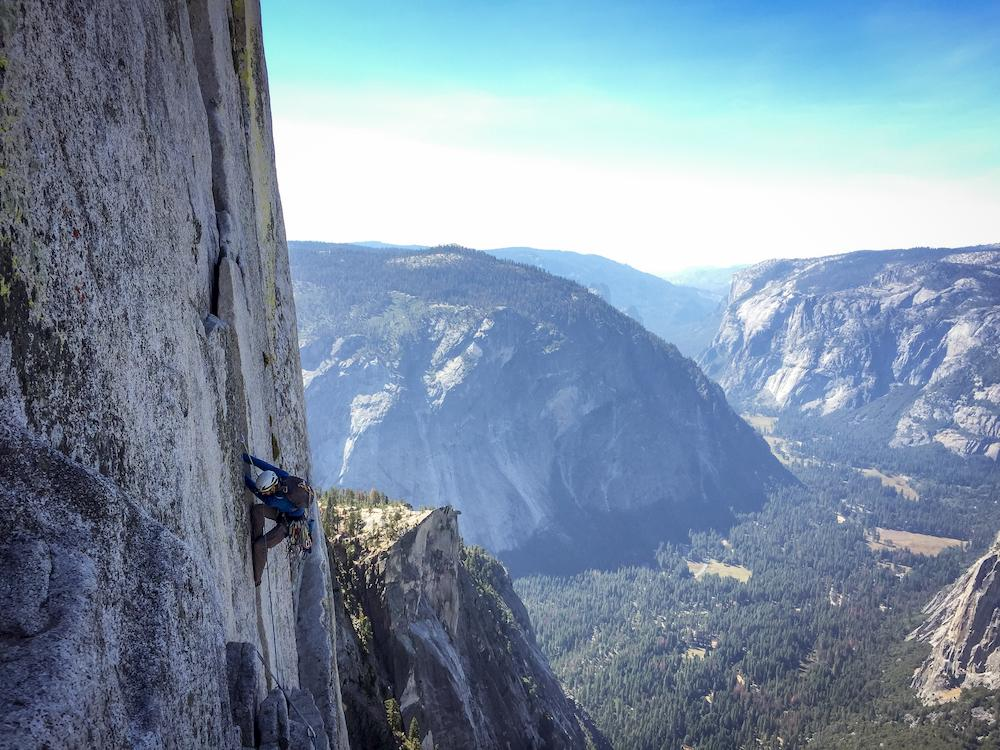

Once I overheard someone describe a kid they met that knew he wanted to be a podiatrist 👣👨‍⚕️ at age 6. This story is not about that person.

My life has been rife with indecision. In fact, a good friend once described me as the _"male Barbie of careers"_. Sure, I eventually found my way to coding, but it was a long, winding road.

## The Early Years

As a kid, I always thought I would like to do ..._stuff_ with computers. I wasn't quite sure what that stuff was, but I wanted to do it.

What I _did_ know, was that programming seemed dense and mystical. Actually I didn't even really know what programming was. I basically thought it was like the movie "Hackers".

In elementary and middle school, my only exposure to computers was through playing Math Blaster, Oregon Trail, and a Super Mario typing game. In high school I took an introductory computer course (basically a Microsoft A+ certification class), and a web design class where we learned a little HTML.

Writing math formula scripts on my graphing calculator was as close as I got to really coding something in grade school. Those miniature programs were silly, but also _exciting_.

## Clueless in College

The smart kids in my high school seemed to be all applying and getting accepted to college. So I blindly followed suit.

I applied and was accepted to the University of Florida as a chemical engineering student (it seemed like a guaranteed job). I stuck with it for about a month before catching wind of what those folks actually do, then changed majors to Computer Science.

I was going for it folks, I was going to pursue my **dream**.

The first day of my intro to computer science class went like this:

A lanky, disheveled man strode into the auditorium fifteen minutes late. He stood at the podium and addressed the class:

_"A little news in the life of Pete. I just found out my_ ***former*** _best friend has been sleeping with my ex-wife."_

Pete then proceeded to teach us binary, hexidecimal, and other very low-level computer science concepts. For homework, we had to solve small, boring puzzles with Java like _Given a number N, print a triangle of #'s to the screen that is N wide and N tall._

I stubbornly worked through those assignments. I coded in notepad.exe and ran my code with the windows command line. I didn't know what an IDE was and I didn't understand how this was going to add up to writing actual software.

In class, there was one student up front that nodded along with everything the instructor said, answered every question, and giggled at every Java idiosyncracy that arose during the lecture.

I _hated_ that student. I hated him because I wished I ***was*** him. How did he know so much in an intro class? I felt so incredibly lost by comparison.

I spent two semesters suffering through Java. Our final project of the second semester was hangman. I finished it while having absolutely no idea what I was doing.

I thought, _"If I've spent a year learning to code, and this is how far I've come, how will I ever make anything useful?"_

## Succombing to Self-doubt

I saw myself as hopelessly outmatched. I convinced myself that coding was for child prodigies and geniuses only seen on TV. I did all the mental gymnastics required to convince myself that I was the problem.

I switched majors again and got my degree in Japanese language.（こんいちは皆さん！）But I doubted my language skills too. In my mind, I couldn't possibly be good enough to work as a translator or interpreter.

So I went back to school to be a firefighter. I reasoned that my father did it for 30 years, had a great retirement plan, and seemed to enjoy the job, so why shouldn't I do the same?

I somehow made it through fire school. Then I became an EMT and a Paramedic. I got hired. Soon I was keeping the roads hot with my lights and sirens blaring, kicking down doors and saving lives!

Except it wasn't like that at all. Most 911 calls are not emergencies--most are monotonous and mundane. And of the calls I ran, the 10% that _were_ true emergencies still haunt me from time to time.

And the pay was awful. I was exposed to a lot of chemicals, disease, and stress for about $14 an hour.

I convinced myself I needed to do better. I went back to school and became a registered nurse, and worked in intensive care and the emergency room.

My situation had improved: now I was being exposed to a lot of chemicals, disease, and stress for about $25 an hour.

## Changing Course

At some point I found myself looking back on my life and wondering how I ended up so far from my dreams. As a kid, I wanted to make things. I wanted to code.

Sometimes I'd find myself sitting at the nurse's station absent-mindedly clicking through Codecademy or freeCodeCamp tutorials.

Then I discovered coding bootcamps.

There's a lot of noise out there about bootcamps. You'd be forgiven for thinking that they're the ponzi scheme of our time after spending a little time researching them on the internet.

The risk didn't matter though. I saw it as an opportunity to escape. I signed up.

Going to code bootcamp turned out to be a transformative experience for a few reasons:

1. **I was surrounded by career changers.** When we introduced ourselves on the first day I found myself in the company of marketing executives, fast-food workers, database administrators, school teachers, and even computer science undergrads.
1. **Everyone struggled to get their code to run.** Sure, some were better than others, but absolutely everyone had difficulties in class and doing the homework.
1. **We built fun things.** Not once did I have to print a triangle with for loops. We built personal websites, games, toy apps, and more. I could feel myself making progress. I actually enjoyed learning.
1. **We were encouraged to find our own answers.** From day one we were told to "google it." It was our mantra. We weren't expected to know everything, but we had to be able to search for the answers.

So there I was with like-minded, indecisive people that were struggling to learn, having fun building things, and just as clueless as I was. It was so radically different from that college class I had taken fifteen years ago. It was invigorating.

## Getting Hired as a Developer

I worked very, very hard in class. I knew that this was my chance to change course. I took it very seriously.

I also knew going in that getting a job was not guaranteed or even likely.

Most employers don't like junior developers, and they like bootcamp grads even less. They view juniors as a liability not worth the money they'll save on a lower salary.

I needed to stand out in a positive way. I needed to convince someone to give me a chance despite my inexperience.

The bootcamp did not bless me with a great resume nor a great portfolio, and as a brand new developer living an hour outside of town, I had no network.

So I went to meetups. I got on a developer slack channel in town and asked a boatload of stupid questions. I worked tirelessly on my resume and portfolio, soliciting feedback from anyone willing to give it. And all the while I machine-gunned my resume to every developer job on indeed that I was remotely qualified for.

Everytually I saw a job-listing on slack. I messaged the poster, sent my resume and portfolio, and setup an interview.

In that interview, I was calm and collected. I made them laugh and answered their questions. My past careers had taught me to maintain my composure and stay calm. One of my interviewers even remarked how it would be great to have a nurse on the team.

I got the job. I quit nursing and became a fulltime developer.

## Words of Wisdom

Here's what I wish someone had told me many years ago at the start of this journey:

* **Stop doubting yourself.** With enough patience and effort, you can learn anything.

* **Do the things that make you happy** and make you feel fulfilled. Don't do something because it's "a good job" or "a steady paycheck".

* **Find comfort in the fact that you're not alone.** We're all making this up as we go along. [Even our mentors struggle to get their code to work](https://twitter.com/getify/status/972495616600293381). Nobody has all the answers.

* **Don't ever forget where you came from.** Remember the things that confused, infuriated, and discouraged you. It will help you remember how far you've come, keep you humble, and remind you to be kind to those following in your footsteps.

Learn from my mistakes, then pay it forward.