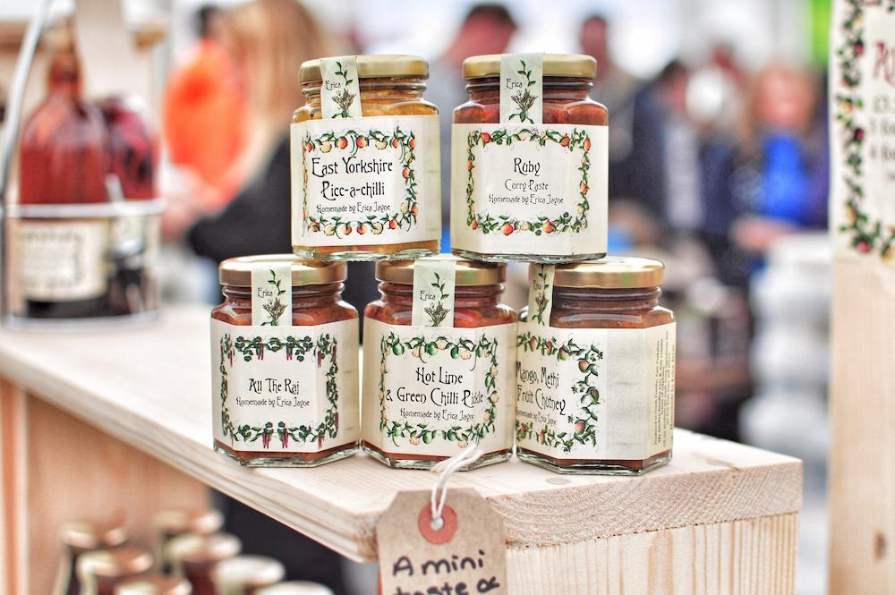

JAMstack is one of those buzzwords that leaves the listener confused whenever it's uttered (see also PWAs, blockchain, and serverless). Despite the name, JAMstack is a fantastic choice for front-end web applications, and definitely worth your time as a front-end developer.

However, defining "JAMstack" is a tricky thing, and the community knows it. There's why there's sites like [jamstack.wtf](https://jamstack.wtf) and [jamstack.org](https://jamstack.org) devoted to explaining just what it is.

Unfortunately, you have to have a solid understanding of web development technologies before explanations of JAMstack start to make sense. So let's start with the basics.

## Let's Review

When I started out as a developer, I had _some_ knowledge of the front-end ecosystem I was entering. There was of course JavaScript, HTML, and CSS, plus single page application (SPA) frameworks like React, Angular, and Vue. I understood two potential options for making web apps with this tooling.

The first is the old-school **server-rendered** route: build your pages in HTML/CSS/JS ahead of time and let the server serve those. Or you could have the server build those pages with a templating language (handlebars, EJS, jinja, etc) as requests came in. The downside here was that either your content was static (that's no fun), or your server was doing a lot of work. Plus, each time the user requested a new page they would see a white screen as the server built/found the page and sent it to the user's browser.

The more modern method uses **client-side rendering**. You write an SPA, and send a big payload of JavaScript to your user upfront when they visit your site. This is the buy-once, cry-once method. The user waits while all the JavaScript downloads, then again while it renders the requested page. After that initial hit, the app is buttery smooth and provides a great experience, because each page change after that is rendered with JavaScript running in the user's browser. Still, that initial page-load is the important one. Users are impatient, and a long initial load time means you're losing traffic.

This always made me think of those signs you see in restaurants and mechanic shops. You know the one:

> We offer three kinds of Services:

> GOOD - FAST - CHEAP

> ...but you can only pick __two__.

## The Chimera Option

It turns out there's another option. This is where things start to get sticky, though. Single page applications are already difficult to think about, and typically we like to think about them as using client-side, on-demand rendering only. However it's now possible to mix and match dynamic and static content on both the client and server.

There's two main camps using this hybrid methodology to web app rendering and delivery. The first is server-rendered single page applications, and the second is JAMstack.

### Server-Rendered SPAs

With a server-rendered SPA, you have to maintain your own server. On initial hit the server pre-renders the page the user requested in HTML/CSS and sends it down to the user. This means the users gets to see a dynamically-rendered page relatively quickly. The server also sends a mess of JavaScript that loads in the background. Now when the user navigates to the next page, the app functions like an SPA and uses that mess of JavaScript to render the new page, instead of asking the server for it. The app only asks the server for data (typically JSON) after that initial page-load.

Some examples of this technology are [NextJS](https://nextjs.org/), [NuxtJS](https://nuxtjs.org/) and [Angular Universal](https://angular.io/guide/universal). For what it's worth, I've used both NextJS and NuxtJS, and they are both fantastic.

The only problem with this method is that, again, you need to maintain your own server. Running your own server is much more costly than a static hosting solution (using someone else's server). There's also some potential security liability involved.

### Pre-Rendered SPAs

You're probably thinking this is a bit silly. The whole point of an SPA is to have a dynamic, on-the-fly rendering of your application at any given point, right? If you pre-render everything, what are you left with?

The answer is a lot, actually. When we build a single page app, we often have various routes or views baked in that don't change. You may have a "home" page, an "about" page, and then your "main" content. Those home and about changes don't really require dynamic data to render anything, but with a traditional SPA they're rendered dynamically all the same. Even the "main" stuff probably lives on a route in some kind of wrapper component, right?

With a pre-rendered SPA, when we "build" the application (bundle with Webpack) we designate what can be safely pre-rendered and what needs to be left alone to render on the client's machine at runtime. Then our bundler pre-renders as much of the application as possible (all the routes), and leaves the rest to be rendered with JavaScript at runtime.

Instead of a single HTML page in your build folder as an entrypoint to your app, you'll have multiple. So when the user asks to visit the "about" page instead of the home page, that "about" page HTML file is ready before the request comes in. After that initial page-load, the JavaScript takes over and handles the page transitions and dynamic portions of the application.

The result is an SPA that has a _fast_ initial load, instead of a long initial load, meaning a great user experience without the cost and maintenance of a server.

Some examples of this technology are [GatsbyJS](https://www.gatsbyjs.org/), [Gridsome](https://gridsome.org/), [NextJS](https://nextjs.org/features/static-exporting), and [NuxtJS](https://nuxtjs.org/guide#static-generated-pre-rendering).

Gatsby and Gridsome are more purpose-built for "static"-site generation, while Next and Nuxt are swiss army knife tools that allow you to do both server-rendering and static-site generation.

**Note**: There's a lot of confusion about Static-Site Generators (SSG). A traditional SSG (Hugo, Jekyll, etc) takes your templated code and generates static HTML files from it. Gatsby and Gridsome are actually a lot more than SSGs. They allow you to smartly pre-build and template content in a lot of various ways.

For example, this blog is built from markdown files, and at build time, Gatsby compiles the markdown files into a React application. You could also query an API or CMS like Wordpress to get your data dynamically at build time. However you're still free to make API calls at runtime too. _You're still building a React app_. You're just pre-rendering some of it.

## Are you going to talk about JAMstack or not?

Yes! Now we can talk about what is and isn't JAMstack. JAMstack stands for JavaScript, APIs, and markup. I find that definition entirely unhelpful, hence the lengthy lead-in for this segment.

JAMstack is really about making awesome websites without running your own server, or at least decoupling your "static" front-end from your back-end data sources. The front-end app should be composed of static files **only** and be its own codebase. That means **no server-rendered content**.

This sounds a little restrictive, but trust me, you can build **a lot** of dynamic content following these rules. Just about anything you can build with create-react-app or an SPA can be a JAMstack site. You can build Blogs, e-commerce sites, marketing pages, and full on web apps all with JAMstack methods.

Clear as mud, right?

### JAMstack FAQ:

I had a lot of questions on my journey to understanding JAMstack. Let's try to address some of those points of confusion.

#### If it's pre-rendered, how do I update it?

You have to rebuild the site/app everytime you update something that is pre-rendered. So if I make a new blog post, I have to rebuild the site and redeploy it.

However, that doesn't mean you have to redeploy everytime your app needs to make an API call. Remember that your site can still run JavaScript on the front-end.

#### If I have to redeploy to update the site, how do my users make updates?

Ah yes, consider the scenario where you make a blog for someone else. They probably don't want to write posts in markdown and push code to github, right? That's OK! You can automate your build step. If they make a new post, all you need to do is *trigger* a build to happen.

[Netlify CMS](https://www.netlifycms.org/) is based around this idea. The user makes their edits on a dashboard (also an SPA), and when they "save", they're really committing the code with git, which then triggers a rebuild.

#### I don't want my users touching git. Ever. I'd rather use Wordpress.

Ah, but you can do that too! You'd have to host your own Wordpress server somewhere, but Wordpress has a JSON API. When your user makes a new post, you simply have to trigger your static site to build somehow. If you're using Gatsby or Gridsome, the build step queries your Wordpress API (or any other CMS, really) for all the available posts and builds the site.

#### What about user comments on blog posts?

That's OK! You can still do all the things we just talked about, and just make a API calls for comments on the fly at runtime. You could build your own comment microservice, or use a premium service [FaunaDB](https://fauna.com/) to store comments for you.

#### What are the advantages to JAMstack?

Typically, you can have faster page loads and a much better user experience using JAMstack methods. Also, because your front-end is detached from the server, security issues are greatly diminished. Plus, it's mostly free or at least very cheap to host a static site.

#### When wouldn't I use JAMstack for a site then?

If all of your front-end content needs to be generated on the fly, JAMstack is not a great choice. For example, if you need dynamic routes, that makes it very difficult to build a static front-end app. Similarly, if you're building a server anyway, maybe it makes more sense to serve the front-end as well.

#### Can you show me some examples of JAMstack sites?

Sure! I've built a whole mess of them.

1. [My blog](https://leewarrick.com/blog) - Built with Gatsby, hosted on Github Pages
1. [The Tech JR Podcast site](https://techjr.dev) - Built with Gridsome, hosted on Netlify and mp3s stored on AWS S3
1. [Babelfish, a translation app](https://leewarrick.com/babelfish) - Built with Gatsby and Google's translation API, hosted on Github pages
1. [Goaler, a todo app](https://leewarrick.com/goaler) - Built with Create-React-App and Firebase, hosted on Github Pages
1. [This Pokedex App](https://leewarrick.com/pokemon-cards) - Built with the Vue CLI and the Poke-API, hosted on Github Pages

## Parting thoughts

JAMstack, like most great technological trends, is a pretty awesome solution with a crummy name. It's not a perfect solution by any stretch, but it empowers front-end developers to build all kinds of sites and applications using their exisiting skills.

So what are you waiting for? Get out there and build something!
