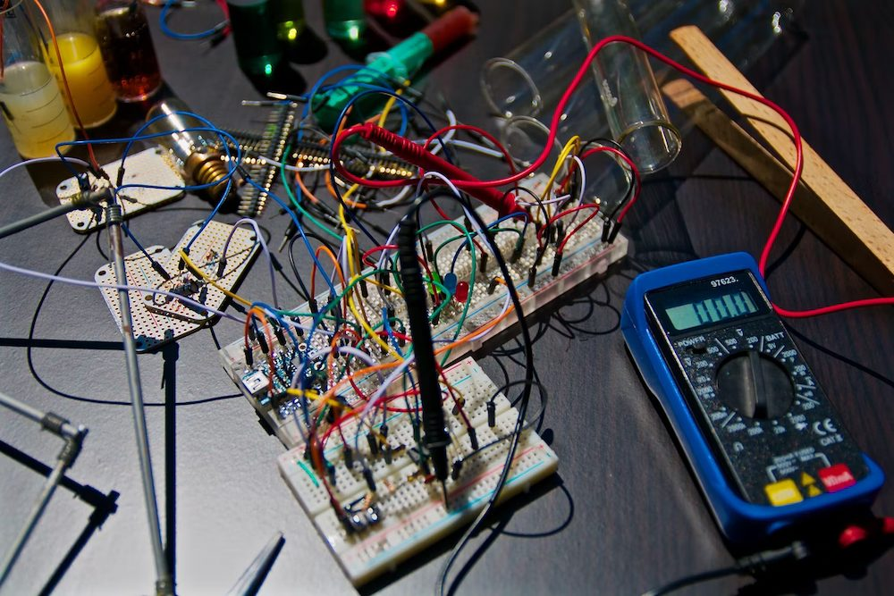

Testing is a subject that nearly every tutorial and course tends to gracefully skip over. This is tragic because as soon as you enter the workforce as a developer, you're going to be expected to write tests. You may even find yourself writing more tests than code. Too many new developers (myself included), walk into their first job blind to testing principles and practices. More than a few develop negative opinions of testing, and some even learn to resent it. 

Tests are not a necessary evil. In fact, I've found a lot of comfort in well-written automated tests as I've progressed in my career. With that said, let's discuss some benefits of tests.

```js js-live autorun no-code scripts="mocha!https://cdnjs.cloudflare.com/ajax/libs/mocha/8.0.1/mocha.min.js,chai!https://cdnjs.cloudflare.com/ajax/libs/chai/4.2.0/chai.min.js,sinon!https://cdnjs.cloudflare.com/ajax/libs/sinon.js/9.0.2/sinon.min.js"
const {
  EVENT_RUN_BEGIN,
  EVENT_RUN_END,
  EVENT_TEST_FAIL,
  EVENT_TEST_PASS,
  EVENT_SUITE_BEGIN,
  EVENT_SUITE_END
} = Mocha.Runner.constants;

mocha.setup({
  ui: "bdd",
  reporter: function(runner) {
    let currentSuite
    let currentParent
    let indent = 0
    runner.once(EVENT_RUN_BEGIN, () => {
    })
    runner.on(EVENT_SUITE_BEGIN, (suite) => {
    })
    runner.on(EVENT_SUITE_END, (suite) => {
      if (suite.root) return
       indent = indent - 2 < 0 ? 0 : indent - 2
    })
    runner.on(EVENT_TEST_PASS, (test) => {
      if (currentParent !== test.parent.parent.title) {
        currentParent = test.parent.parent.title
        if (currentParent) {
          console.log(`${" ".repeat(indent)}${currentParent}`)
          indent += 2
        }
      }
      if (currentSuite !== test.parent.title) {
        currentSuite = test.parent.title
        console.log(`${" ".repeat(indent)}${currentSuite}`)
        indent += 2
      }

      console.log(`${" ".repeat(indent)}🟢 ${test.title}`)
    });
    runner.on(EVENT_TEST_FAIL, (test) => {
      if (currentParent !== test.parent.parent.title) {
        currentParent = test.parent.parent.title
        if (currentParent) {
          console.log(`${" ".repeat(indent)}${currentParent}`)
          indent += 2
        }
      }
      if (currentSuite !== test.parent.title) {
        currentSuite = test.parent.title
        console.log(`${" ".repeat(indent)}${currentSuite}`)
        indent += 2
      }

      console.log(`${" ".repeat(indent)}❌ ${test.title}`)
    });
    runner.once(EVENT_RUN_END, () => {
      indent = 0
      console.log(`${runner.stats.passes}/${runner.stats.passes + runner.stats.failures} tests passing`);
    });
  },
  cleanReferencesAfterRun: true
})
window.assert = chai.assert;
window.expect = chai.expect;
window.mochaRun = mocha.run
mocha.run = function() {
  mocha.unloadFiles()
  window.mochaRun()
}
```

## Tests make maintaining and refactoring code much easier

Let's say for example that you had a function that checks to see if a word is a palindrome (it's the same backwards and forwards):

```js 
function isPalindrome(str) {
  str = str.toLowerCase()
  let strNoPunc = ""
  const letters = 'abcdefghijklmnopqrstuvwxyz'.split("")
  for(var i = 0; i < str.length; i++) {
    if(letters.indexOf(str[i]) > -1) strNoPunc += str[i]
  }
  let reversed = ""
  for (var i = strNoPunc.length - 1; i >= 0; i--) {
    reversed += strNoPunc[i]
  }
  return reversed === strNoPunc
}
```
You haven't written a for loop since you first learned JavaScript, so it takes you a second to read through and see what's happening in the function. It's been humming along in your codebase for quite some time before you came across it, but you know you could write a more readable version. How do you proceed, though?

One way is to manually test with `console.log`:

```js js-live autorun
function isPalindrome(str) {
  str = str.toLowerCase()
  let strNoPunc = ""
  const letters = 'abcdefghijklmnopqrstuvwxyz'.split("")
  for(var i = 0; i < str.length; i++) {
    if(letters.indexOf(str[i]) > -1) strNoPunc += str[i]
  }
  let reversed = ""
  for (var i = strNoPunc.length - 1; i >= 0; i--) {
    reversed += strNoPunc[i]
  }
  return reversed === strNoPunc
}
console.log(isPalindrome('radar'))
console.log(isPalindrome('pasta'))
console.log(isPalindrome('radar!'))
```
Apparently `isPalindrome` returns a boolean and is able to handle special characters. But what about spaces? What about uppercase letters? Does it handle numbers? More importantly, _which one of those cases are important in your codebase?_

That's the rub when it comes to refactoring this function. You know more or less what the function does, but what about all the edge cases? What if it's fed a non-string? Does it return a boolean or throw an error? Does that matter for your existing code that's using `isPalindrome`?

In an ideal world, you'd have some well-written tests that outline the edge cases of your function. Test cases should cover the functionalities and behaviors of your code that are critical for the final product. Try rewriting the function below and running the tests to see if you can do better.

```js js-live scripts="mocha,chai"
function isPalindrome(str) {
  str = str.toLowerCase()
  let strNoPunc = ""
  const letters = 'abcdefghijklmnopqrstuvwxyz'.split("")
  for(var i = 0; i < str.length; i++) {
    if(letters.indexOf(str[i]) > -1) strNoPunc += str[i]
  }
  let reversed = ""
  for (var i = strNoPunc.length - 1; i >= 0; i--) {
    reversed += strNoPunc[i]
  }
  return reversed === strNoPunc
}

describe('isPalindrome', function() {
  it('should return a boolean', function() {
    expect(typeof isPalindrome('banana')).to.eq('boolean')
  })
  it('should return true for a palindrome', function() {
    expect(isPalindrome('radar')).to.be.true
  })
  it('should return false for non-palindromes', function() {
    expect(isPalindrome('banana')).to.be.false
  })
  it('should ignore special characters', function() {
    expect(isPalindrome('radar!')).to.be.true
  })
  it('should ignore spaces', function() {
    expect(isPalindrome('my gym')).to.be.true
  })
  it('should ignore letter casing', function() {
    expect(isPalindrome('Eva, can I see bees in a cave?')).to.be.true
  })
})

mocha.run()
```

Were you able to get all the test cases to pass?

Did you write something like the following? If you didn't, can you see what the solution below is missing? Try and add the missing code using the test cases:

```js js-live scripts="mocha,chai"
function isPalindrome(str) {
  return str === str.split("").reverse().join("")
}

describe('isPalindrome', function() {
  it('should return a boolean', function() {
    expect(typeof isPalindrome('banana')).to.eq('boolean')
  })
  it('should return true for a palindrome', function() {
    expect(isPalindrome('radar')).to.be.true
  })
  it('should return false for non-palindromes', function() {
    expect(isPalindrome('banana')).to.be.false
  })
  it('should ignore special characters', function() {
    expect(isPalindrome('radar!')).to.be.true
  })
  it('should ignore spaces', function() {
    expect(isPalindrome('my gym')).to.be.true
  })
  it('should ignore letter casing', function() {
    expect(isPalindrome('Eva, can I see bees in a cave?')).to.be.true
  })
})

mocha.run()
```

In the code above, we solved the main palindrome problem, but failed to handle special characters, casing, and spaces. Here's the code with solutions for all the tests:

```js js-live scripts="mocha,chai"
function isPalindrome(str) {
  str = str.toLowerCase().replaceAll(/[^a-z]/g, "")
  return str === str.split("").reverse().join("")
}

describe('isPalindrome', function() {
  it('should return a boolean', function() {
    expect(typeof isPalindrome('banana')).to.eq('boolean')
  })
  it('should return true for a palindrome', function() {
    expect(isPalindrome('radar')).to.be.true
  })
  it('should return false for non-palindromes', function() {
    expect(isPalindrome('banana')).to.be.false
  })
  it('should ignore special characters', function() {
    expect(isPalindrome('radar!')).to.be.true
  })
  it('should ignore spaces', function() {
    expect(isPalindrome('my gym')).to.be.true
  })
  it('should ignore letter casing', function() {
    expect(isPalindrome('Eva, can I see bees in a cave?')).to.be.true
  })
})

mocha.run()
```

This is a small example in isolation, but imagine your code base has many functions like this that are all interconnected in your project. Assuming your tests are up to date, you can hopefully imagine the peace of mind you get from having tests to double-check your code whenever you need to refactor it in the future.

## Tests can be great documentation

Documentation is a perennial pain for most developers. It's so difficult to keep improving software as well as keeping its documentation up to date because essentially the two are related but disconnected. What if you had documentation that read itself and told you when your code and docs were out of sync?

Good news! That's basically what well-written tests do. Let's look at the case titles from the previous section:

```
should return a boolean
should return true for a palindrome
should return false for non-palindromes
should ignore special characters
should ignore spaces
should ignore letter casing
```

Well-written tests can be a great reference for understanding how a piece of code works without having to step through the implementation. Looking at the test cases above, you're able to learn a lot about the function in question without even looking at the function's code.

Not only do these tests tell the developer _exactly_ how the function is supposed to behave, when you run the tests they **enforce** those rules as well. Including automation that runs these tests before deploys provides a pretty powerful system to prevent breaking the project when refactoring or introducing new features.

## Tests force us to reflect on implementation

Testing forces us to think about our code beyond how it solves our immediate problem. Naturally that means thinking of aforementioned edge cases, but it also makes us think about the how the program itself is constructed.

Let's say we were working on a calculator application. We're implementing an add function for our app, and so we write it to take two numbers, and output them to the paragraph tag below:

```html html-live no-edit
<h3>Calculator Output: <span id="output"></span></h3>
```

```js js-live autorun
function add(num1, num2) {
  const sum = num1 + num2
  document.getElementById('output').textContent = sum
}

add(2, 3)
```

All done, right? Well, let's say we now want to write a test for our add function. Unlike `isPalindrome` above, `add` doesn't just return its output, it sends it to the DOM. Our `add` function has a side effect: it depends on certain HTML elements to exist to function properly. To write our test, we have to either stub `getElementById` and monitor it to make sure it's being passed the correct input, or access the `#output` element to check its text. 

We could do those things, but do we really need to test that `getElementById` is implemented correctly? I'd argue that the engineers at Google and Mozilla are very capable of maintaining this JS feature without us needing to test it. What we really need to know is if we're adding correctly.

With that in mind, it might make more sense to split our function into two and separate the DOM manipulation from the calculation. 

```js js-live scripts=mocha,chai
function add(num1, num2) {
  return num1 + num2
}
function updateOutput(value) {
  document.getElementById('output').textContent = value
}

describe('add', () => {
	it('should add two numbers', () => {
		expect(add(2, 3)).to.eq(5)
	})
})

mocha.run()
```

We've isolated a side effect and made `add` a pure function without really thinking about the code from a functional standpoint. We refactored to make testing easier, but code that's easy to test is also more reusable and maintainable. Since this is a calculator app, we're likely to need to update the DOM in the same way for other operations like multiplication and division. We're also now free to use the add function in other places in the app as we see fit.

Even though it's a bit silly to write a test for something like an addition operation, the exercise of thinking about the code and how to test it has guided us to a better solution. This is why it's often said that code that's hard to test is a "code smell". 

## Closing thoughts 

Writing tests is like writing documentation or learning Git: you don't appreciate it until you need it. Because tests don't directly contribute to the functionality of the product, they're often overlooked by teams looking to iterate quickly. You'd be hard-pressed to find good tutorials on tests or courses that bother to spend time teaching how to write them for the same reason.

However, the nature of code is that it's temporary. There will always be revisions, refactors, or rewrites to any code that lives long enough to be deemed legacy. In each of those cases, well-written tests can make a huge difference when revisiting old code.

Sadly, I didn't actually encounter testing in a meaningful way until I was already employed as a junior developer. When I tried to submit my first pull request at my first job, I had to go back and write tests not only for the code in my pull request, but for code other engineers had merged and left untested. I can tell you from experience that the last few days of your first sprint are not when you want to be learning how to write tests.

Years later, I found myself writing tests to tame a project that was previously seen as an untenable monster of legacy code. Our team inherited the project and codebase from a prevous contractor, and therefore were behind the curve in understanding how everything worked. Good testing practices showed us how we could keep bugs from reaching production and brought a new level of confidence to our team despite our unfamiliar codebase.

Testing is a big subject, but it's an important one. Give it the head space it deserves in your career. The codebase you save might just be your own.
